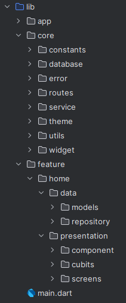

## 🤳 Screens
## 📁 File Structure




## 📱 UI


## 🛠 Dependencies

```pubspec.yaml
  cupertino_icons: ^1.0.2
  shared_preferences: ^2.2.1
  dio: ^5.3.3
  flutter_screenutil: ^5.9.0
  fluttertoast:
  flutter_bloc: ^8.1.6
  get_it: ^7.6.4
  dartz: ^0.10.1
  iconly: ^1.0.1
```


